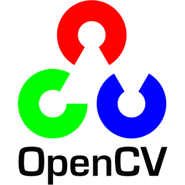
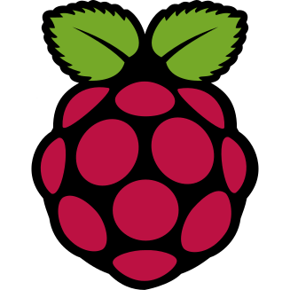

<h1>Hey!</h1>

<h4>

I am Iftakhar Kaunain Ashhar, a software engineer from India, aspiring to be at the edge of the cutting edge.

I work primarily on frontend development with React and React Native. I am exploring backend with Node.js and looking into Java and Spring.

At present, I am working with SpiceJet as a software engineer. I am developing (technically leading) a new cross-platform app for our crew members. I developed and designed a monolithic frontend architecture that allows maximum code sharing between a React Native mobile app and a React web app! 

I actively work with :

</h4>

|  |  |  |  |  |
| :----------------------------------------------------------------------: | :----------------------------------------------------------------------: | :----------------------------------------------------------------------: | :----------------------------------------------------------------------: | :----------------------------------------------------------------------: |
|  |  |  |  |  |

<h4>

I actively work with :

</h4>

|  |  |  |  |  |
| :----------------------------------------------------------------------: | :----------------------------------------------------------------------: | :----------------------------------------------------------------------: | :----------------------------------------------------------------------: | :----------------------------------------------------------------------: |
|  |  |  |  |  |
|  |  |  |  |  |

<h4>

I am learning: 

</h4>

|  |  |
| :----------------------------------------------------------------------: | :----------------------------------------------------------------------: |

<h3>Resumé:</h3>

|  |
| :-------------------------------------------------------------------------------------------------------------------------------------------------------------------: |

<h3>Contact:</h3>

|  |  |
| :------------------------------------------------------------------------------------------------------------------------------------------: | :--------------------------------------------------------------------------------------------------------------------------------: |
