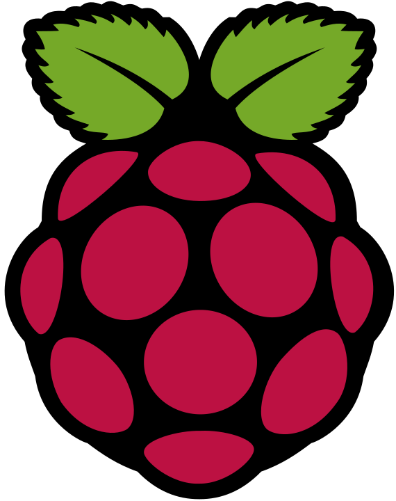

<h1>Hey!</h1>
<h4>
I am Iftakhar Kaunain Ashhar, a senior Mechanical Engineering Undergraduate.

I work on front-end development. I am learning back-end to become a full-stack software developer.

I have worked as an Intern Front-end Engineer at an early stage startup. I worked with HTML, CSS, SCSS, Bootstrap, JavaScript, React and Vue.

I have also worked at my college's chapter of Marine Technology Society, the Autonomous Underwater Vehicle club, as a Software Engineer. I worked with ROS, Gazebo, Python, OpenCV, Embedded C, Arduino and RaspberryPi.

I have worked/work with :

</h4>

|       |            |      |                       |  |       |         |
| :---------------------------------------------------------------------------: | :----------------------------------------------------------------------------: | :-------------------------------------------------------------------------------: | :------------------------------------------------------------------------------: | :----------------------------------------------------------------------: | :---------------------------------------------------------------------------: | :----------------------------------------------------------------------: |
|           |  |  |          |            |                    |            |
|  |              |                  |  |     |             |  |
|     |                    |              |              |               |  |   |

&emsp;&emsp;&emsp;&nbsp;

<h3>Resumé:</h3>

|  |
| :-------------------------------------------------------------------------------------------------------------------------------------------------------------------: |

<h3>Contact:</h3>

|  |  |
| :------------------------------------------------------------------------------------------------------------------------------------------: | :--------------------------------------------------------------------------------------------------------------------------------: |
